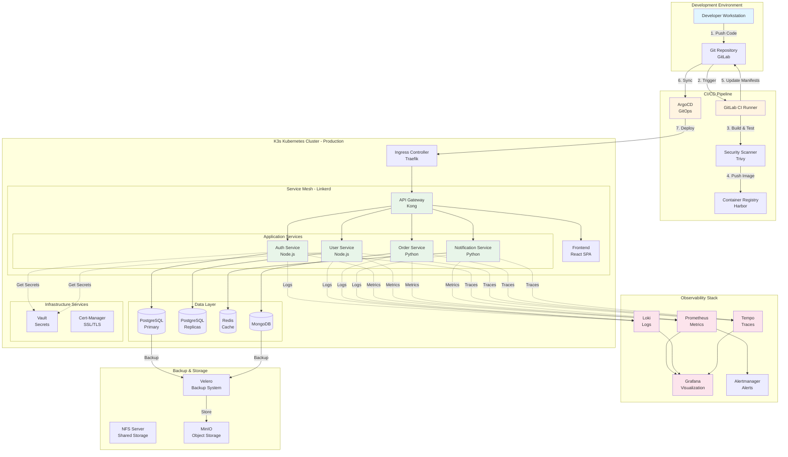
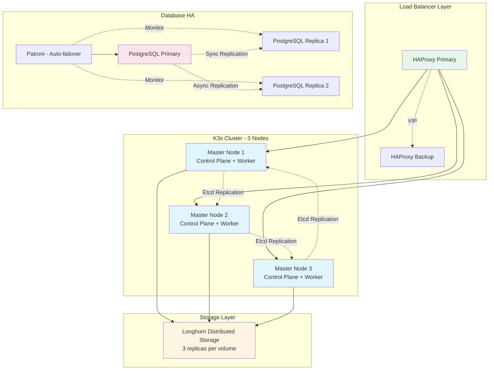
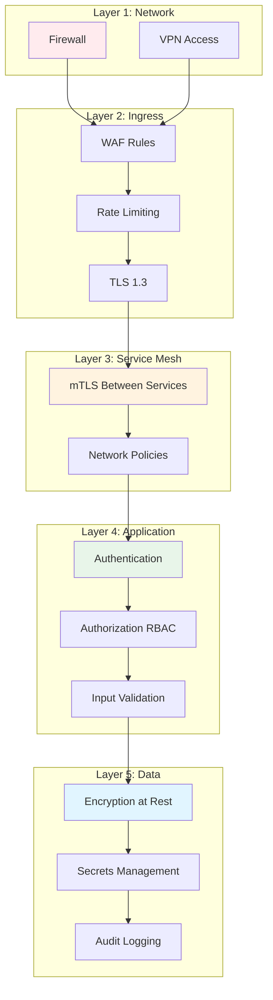

# 🏗️ Architecture Overview - DevOps Microservices On-Premise

## Vue d'ensemble

Cette architecture est conçue pour un déploiement 100% on-premise de microservices, optimisée pour la haute disponibilité, la scalabilité et le coût minimal.

## Principes Architecturaux

### 1. Cloud-Native On-Premise
- Utilisation des patterns cloud (12-factor app, containers, orchestration)
- Déploiement sur infrastructure physique propriétaire
- Indépendance totale vis-à-vis des fournisseurs cloud publics

### 2. Infrastructure as Code
- Tout est versionné dans Git
- Reproductibilité garantie
- Audit trail complet

### 3. GitOps
- Git comme source de vérité unique
- Déploiements déclaratifs
- Réconciliation automatique

### 4. Observability-First
- Instrumentation dès le développement
- Métriques, logs et traces systématiques
- Alerting proactif

### 5. Security by Design
- Défense en profondeur
- Principe du moindre privilège
- Chiffrement par défaut

## Architecture Globale



## Composants Clés

### 1. Development Environment

#### Git Repository (GitLab)
- **Rôle** : Source de vérité unique pour code et configuration
- **Configuration** :
  - GitLab CE self-hosted
  - Branching strategy : GitFlow
  - Protected branches (main, staging, production)
- **Coût** : €0 (open-source)

### 2. CI/CD Pipeline

#### GitLab CI Runner
- **Rôle** : Exécution des pipelines CI/CD
- **Configuration** :
  - Docker-in-Docker executor
  - 2-4 runners parallèles
  - Auto-scaling avec K3s
- **Pipeline Stages** :
  1. Build
  2. Test (unit, integration)
  3. Security Scan
  4. Package (Docker image)
  5. Push to Registry
  6. Deploy (via ArgoCD)

#### Security Scanner (Trivy)
- **Rôle** : Scan des vulnérabilités dans images Docker
- **Fonctionnalités** :
  - Scan OS packages
  - Scan dependencies
  - Scan IaC (Terraform, Kubernetes)
- **Seuils** :
  - 0 Critical CVE tolérés en production
  - Alertes sur High CVE

#### Container Registry (Harbor)
- **Rôle** : Stockage sécurisé des images Docker
- **Fonctionnalités** :
  - Scanning intégré
  - RBAC granulaire
  - Replication inter-registries
  - Image signing (Notary)
- **Sizing** :
  - 500GB storage initial
  - Rétention : 30 dernières images par service

#### ArgoCD (GitOps)
- **Rôle** : Déploiement déclaratif sur Kubernetes
- **Configuration** :
  - Auto-sync enabled
  - Self-healing enabled
  - Rollback automatique sur échec
- **Patterns** :
  - App-of-apps pattern
  - Multi-environment (dev/staging/prod)

### 3. Kubernetes Cluster (K3s)

#### Pourquoi K3s vs K8s vanilla ?
- ✅ 50% plus léger (40MB vs 100MB)
- ✅ Production-ready et certifié CNCF
- ✅ Intègre SQLite pour HA simple
- ✅ Consommation ressources réduite
- ✅ Idéal on-premise

#### Configuration Production
```yaml
Cluster:
  Nodes: 3 (HA)
  Node Sizing:
    - 16 CPU cores
    - 32GB RAM
    - 500GB SSD
  Network: Flannel (CNI)
  Storage: Longhorn (distributed block storage)
```

#### Ingress Controller (Traefik)
- Inclus par défaut dans K3s
- TLS/SSL automatique via cert-manager
- Load balancing L7
- Rate limiting

#### Service Mesh (Linkerd)
- **Rôle** : Communication inter-services sécurisée
- **Fonctionnalités** :
  - mTLS automatique
  - Traffic shaping
  - Circuit breaking
  - Observability (golden metrics)
- **Vs Istio** : 10x plus léger, 50% moins de latency

### 4. Application Layer

#### Frontend (React SPA)
- **Stack** :
  - React 18+
  - TypeScript
  - Vite (build tool)
  - Material-UI
- **Deployment** :
  - Nginx container
  - CDN caching (Varnish)
  - Horizontal scaling (2-10 pods)

#### API Gateway (Kong)
- **Rôle** : Point d'entrée unique pour tous les services
- **Fonctionnalités** :
  - Authentication (JWT, OAuth2)
  - Rate limiting
  - Request transformation
  - API versioning
- **Plugins** :
  - Prometheus metrics
  - Logging
  - CORS

#### Microservices

##### Auth Service (Node.js)
- **Responsabilités** :
  - Authentication (login, logout)
  - Authorization (permissions)
  - Token management (JWT)
- **Base de données** : PostgreSQL
- **Cache** : Redis

##### User Service (Node.js)
- **Responsabilités** :
  - User CRUD
  - Profile management
  - Preferences
- **Base de données** : PostgreSQL (read replicas)

##### Order Service (Python)
- **Responsabilités** :
  - Order management
  - Business logic
  - Workflow orchestration
- **Base de données** : MongoDB
- **Framework** : FastAPI

##### Notification Service (Python)
- **Responsabilités** :
  - Email notifications
  - SMS
  - Push notifications
- **Queue** : Redis (Bull/Celery)

### 5. Data Layer

#### PostgreSQL (Primary + Replicas)
- **Configuration** :
  - 1 Primary (read/write)
  - 2 Replicas (read-only)
  - Synchronous replication
- **High Availability** :
  - Patroni pour auto-failover
  - HAProxy pour load balancing
- **Backup** :
  - WAL archiving continu
  - Snapshot quotidien
  - Rétention 30 jours

#### MongoDB
- **Configuration** :
  - Replica Set (3 membres)
  - Oplog pour synchronisation
- **Use cases** :
  - Documents flexibles (orders)
  - Données non-relationnelles

#### Redis
- **Configuration** :
  - Redis Cluster (3 masters, 3 replicas)
  - Persistence : RDB + AOF
- **Use cases** :
  - Session cache
  - Rate limiting
  - Job queue

### 6. Observability Stack

#### Prometheus
- **Métriques collectées** :
  - Application metrics (custom)
  - Kubernetes metrics (kubelet)
  - Node metrics (node-exporter)
  - Service mesh metrics (Linkerd)
- **Rétention** : 30 jours
- **Scrape interval** : 15s

#### Loki
- **Logs collectés** :
  - Application logs
  - Kubernetes events
  - Ingress logs
  - Audit logs
- **Rétention** : 30 jours (full), 90 jours (index)
- **Storage** : Object storage (MinIO)

#### Tempo
- **Traces** :
  - Distributed tracing
  - OpenTelemetry compatible
  - Sampling rate : 10% (production)
- **Rétention** : 7 jours

#### Grafana
- **Dashboards** :
  - Application performance
  - Infrastructure health
  - Business metrics
  - Alerting rules
- **Utilisateurs** :
  - LDAP/SSO integration
  - RBAC par équipe

### 7. Security

#### HashiCorp Vault
- **Rôle** : Gestion centralisée des secrets
- **Configuration** :
  - Auto-unseal (KMS)
  - HA avec Raft storage
- **Secrets** :
  - Database credentials
  - API keys
  - TLS certificates
- **Rotation** : Automatique tous les 90 jours

#### Cert-Manager
- **Rôle** : Gestion automatique des certificats SSL/TLS
- **Providers** :
  - Let's Encrypt (production)
  - Self-signed (dev)
- **Auto-renewal** : 30 jours avant expiration

### 8. Backup & Storage

#### MinIO (Object Storage)
- **Use cases** :
  - Logs storage (Loki)
  - Backups storage
  - Assets storage
- **Configuration** :
  - Distributed mode (4+ nodes)
  - Erasure coding
  - Versioning enabled

#### Velero (Kubernetes Backup)
- **Sauvegarde** :
  - Kubernetes resources (YAML)
  - Persistent volumes
- **Fréquence** :
  - Quotidien (full)
  - Horaire (incrémental)
- **Rétention** : 30 jours

## Flux de Données

### 1. User Request Flow
```
User → HTTPS (Traefik) → API Gateway (Kong) → Service Mesh (Linkerd) 
→ Microservice → Database
```

### 2. Deployment Flow
```
Git Push → GitLab CI → Build → Test → Scan → Push to Harbor 
→ Update Git Manifest → ArgoCD Sync → K3s Deployment
```

### 3. Observability Flow
```
Application → Prometheus (metrics) → Grafana
            → Loki (logs) → Grafana
            → Tempo (traces) → Grafana
```

## Scalabilité

### Horizontal Scaling

| Composant | Min Replicas | Max Replicas | Trigger |
|-----------|--------------|--------------|---------|
| Frontend | 2 | 10 | CPU > 70% |
| Auth Service | 2 | 8 | CPU > 70% |
| User Service | 2 | 8 | CPU > 70% |
| Order Service | 2 | 10 | CPU > 70% |
| Notification Service | 2 | 6 | Queue depth > 100 |

### Vertical Scaling

| Composant | Resources (Requests) | Resources (Limits) |
|-----------|----------------------|-------------------|
| Frontend | 100m CPU, 128Mi RAM | 500m CPU, 512Mi RAM |
| Microservices | 250m CPU, 256Mi RAM | 1 CPU, 1Gi RAM |
| Databases | 1 CPU, 2Gi RAM | 4 CPU, 8Gi RAM |

## Haute Disponibilité

### Architecture HA



### Points de Défaillance

| Composant | SPOF? | Mitigation |
|-----------|-------|------------|
| Load Balancer | ❌ Non | HAProxy VRRP (VIP floating) |
| K3s Masters | ❌ Non | 3 nodes avec etcd distribué |
| Workers | ❌ Non | Pods répartis sur 3 nodes |
| Storage | ❌ Non | Longhorn 3-way replication |
| PostgreSQL | ❌ Non | Patroni auto-failover |
| MongoDB | ❌ Non | Replica Set avec élection |
| Redis | ❌ Non | Cluster mode avec replicas |

### SLA Targets

| Métrique | Objectif | Réalité Attendue |
|----------|----------|------------------|
| **Availability** | 99.9% | 99.95% (4.4h/an downtime) |
| **RTO** (Recovery Time) | < 4h | 30 minutes |
| **RPO** (Recovery Point) | < 1h | 15 minutes |
| **MTTR** (Mean Time to Repair) | < 2h | 45 minutes |
| **MTBF** (Mean Time Between Failures) | > 720h | 1000h+ |

## Sécurité

### Defense in Depth



### Security Controls

| Control | Implémentation | Phase |
|---------|----------------|-------|
| **Network Segmentation** | Kubernetes Network Policies | Phase 2 |
| **Encryption in Transit** | TLS 1.3 + mTLS (Linkerd) | Phase 2 |
| **Encryption at Rest** | LUKS (disk) + DB encryption | Phase 3 |
| **Secrets Management** | Vault | Phase 2 |
| **Identity & Access** | OAuth2/OIDC + RBAC | Phase 2 |
| **Image Scanning** | Trivy in CI/CD | Phase 1 |
| **Runtime Protection** | Falco | Phase 3 |
| **Audit Logging** | Kubernetes audit logs | Phase 2 |

## Performance

### Latency Targets

| Endpoint Type | P50 | P95 | P99 |
|---------------|-----|-----|-----|
| **API Gateway** | < 50ms | < 100ms | < 200ms |
| **Auth Service** | < 100ms | < 200ms | < 500ms |
| **User Service** | < 50ms | < 100ms | < 200ms |
| **Order Service** | < 200ms | < 500ms | < 1s |

### Throughput Targets

| Service | Requests/sec | Concurrent Users |
|---------|--------------|------------------|
| **Frontend** | 1,000 | 5,000 |
| **API Gateway** | 500 | 2,000 |
| **Auth Service** | 200 | 1,000 |
| **User Service** | 300 | 1,500 |

## Évolution & Roadmap

### Phase 1 (POC) - Semaine 1-4
- Docker Compose
- GitLab CI basique
- Monitoring simple (Prometheus + Grafana)

### Phase 2 (MVP) - Semaine 5-16
- K3s single node → 2 nodes
- ArgoCD
- Observabilité complète (Prometheus + Loki + Tempo)
- Vault

### Phase 3 (Production) - Semaine 17-32
- K3s HA (3 nodes)
- Linkerd Service Mesh
- DR & Backup (Velero)
- Security hardening

### Phase 4 (Post-Production) - Maintenance
- Optimisation performance
- AI/ML observability
- Chaos engineering
- Multi-cluster (si besoin futur)

---

**Document Version** : 1.0  
**Dernière Mise à Jour** : 2026-02-12  
**Auteur** : Équipe Architecture
