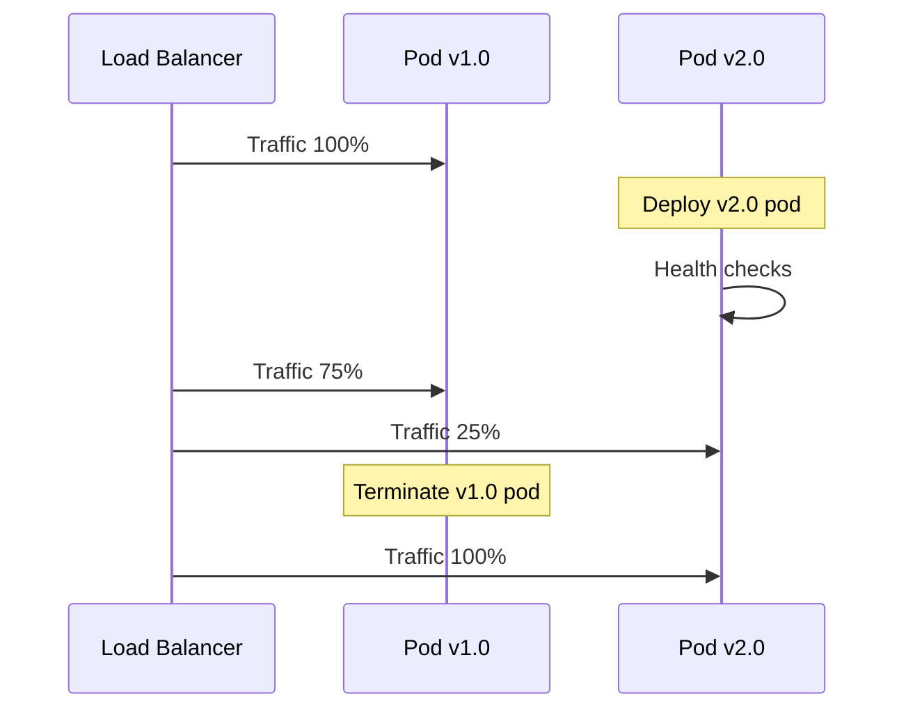
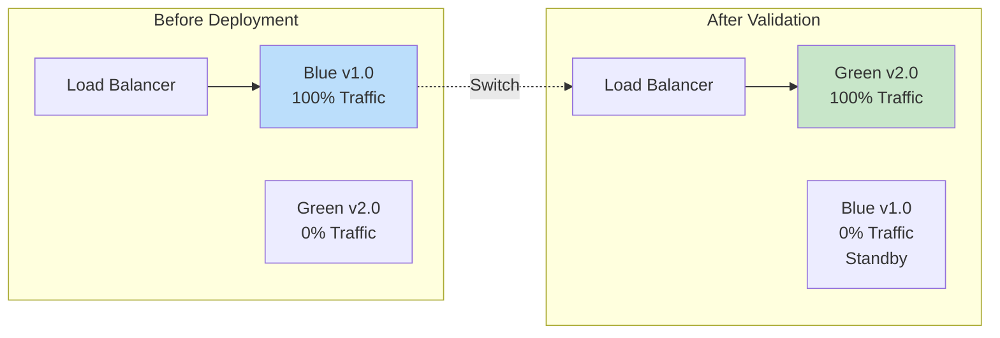
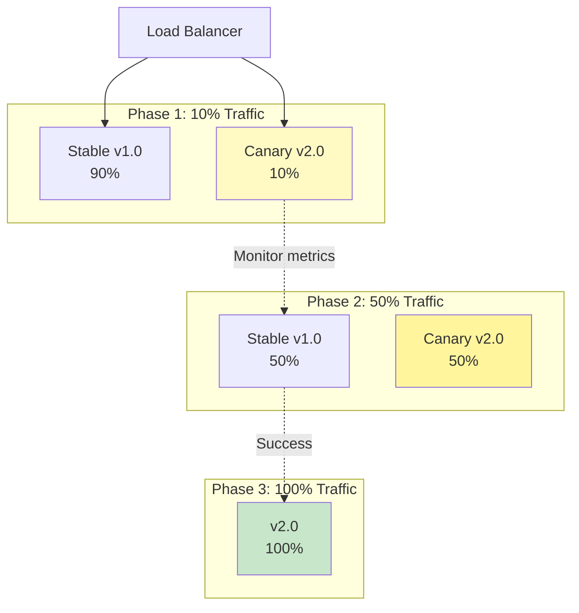

# 🔄 CI/CD Pipeline Détaillé

## Vue d'ensemble

Ce document décrit le pipeline CI/CD complet, de la validation du code à la mise en production, en utilisant GitLab CI et ArgoCD dans une approche GitOps.

## Architecture du Pipeline

```mermaid
graph LR
    subgraph "Developer"
        DEV[Developer]
        LOCAL[Local Build & Test]
    end
    
    subgraph "GitLab Repository"
        GIT[Git Push]
        MR[Merge Request]
    end
    
    subgraph "CI Pipeline - GitLab CI"
        LINT[Lint & Format]
        BUILD[Build Application]
        UNITTEST[Unit Tests]
        INTTEST[Integration Tests]
        SONAR[Code Quality<br/>SonarQube]
        TRIVY[Security Scan<br/>Trivy]
        DOCKERBUILD[Build Docker Image]
        PUSH[Push to Harbor]
    end
    
    subgraph "CD Pipeline - ArgoCD"
        GITOPS[Update Manifests]
        ARGOCD[ArgoCD Sync]
        DEPLOY[Deploy to K3s]
        SMOKE[Smoke Tests]
        ROLLBACK{Health Check}
    end
    
    subgraph "Environments"
        DEV_ENV[Development]
        STAGING[Staging]
        PROD[Production]
    end
    
    DEV -->|1| LOCAL
    LOCAL -->|2| GIT
    GIT -->|3| MR
    MR -->|4 Trigger| LINT
    LINT --> BUILD
    BUILD --> UNITTEST
    UNITTEST --> INTTEST
    INTTEST --> SONAR
    SONAR --> TRIVY
    TRIVY --> DOCKERBUILD
    DOCKERBUILD --> PUSH
    PUSH -->|5| GITOPS
    GITOPS -->|6| ARGOCD
    ARGOCD -->|7| DEPLOY
    DEPLOY --> SMOKE
    SMOKE --> ROLLBACK
    ROLLBACK -->|Success| DEV_ENV
    ROLLBACK -->|Failure| DEPLOY
    DEV_ENV -->|Promote| STAGING
    STAGING -->|Promote| PROD
    
    style LINT fill:#e3f2fd
    style BUILD fill:#e3f2fd
    style TRIVY fill:#fff3e0
    style DOCKERBUILD fill:#e8f5e9
    style ARGOCD fill:#f3e5f5
    style ROLLBACK fill:#ffebee
```



## Stages du Pipeline

### Stage 1: Code Quality & Validation

#### 1.1 Lint & Format
**Objectif** : Garantir la cohérence du code

**Outils** :
- **JavaScript/Node.js** : ESLint + Prettier
- **Python** : Pylint + Black
- **YAML** : yamllint

**Configuration GitLab CI** :
```yaml
lint:
  stage: lint
  image: node:20-alpine
  script:
    - npm ci
    - npm run lint
    - npm run format:check
  only:
    - merge_requests
    - main
```

**Critères de Succès** :
- ✅ 0 erreur ESLint
- ✅ Code formaté selon Prettier
- ⚠️ Warnings tolérés (< 10)

#### 1.2 Code Quality (SonarQube)
**Objectif** : Analyse statique approfondie

**Métriques** :
- Code coverage > 70%
- Maintainability rating A ou B
- Security rating A
- 0 Critical bugs
- Technical debt < 5%

**Configuration** :
```yaml
sonarqube:
  stage: test
  image: sonarsource/sonar-scanner-cli:latest
  script:
    - sonar-scanner
      -Dsonar.projectKey=$CI_PROJECT_NAME
      -Dsonar.sources=src
      -Dsonar.host.url=$SONAR_HOST
      -Dsonar.login=$SONAR_TOKEN
  only:
    - merge_requests
    - main
```

### Stage 2: Build & Test

#### 2.1 Build Application
**Objectif** : Compiler l'application

**Node.js** :
```yaml
build:node:
  stage: build
  image: node:20-alpine
  script:
    - npm ci
    - npm run build
  artifacts:
    paths:
      - dist/
    expire_in: 1 day
```

**Python** :
```yaml
build:python:
  stage: build
  image: python:3.11-slim
  script:
    - pip install -r requirements.txt
    - python -m compileall src/
  artifacts:
    paths:
      - src/
    expire_in: 1 day
```

#### 2.2 Unit Tests
**Objectif** : Tests unitaires rapides

**Configuration** :
```yaml
test:unit:
  stage: test
  image: node:20-alpine
  script:
    - npm ci
    - npm run test:unit -- --coverage
  coverage: '/Coverage: \d+\.\d+%/'
  artifacts:
    reports:
      coverage_report:
        coverage_format: cobertura
        path: coverage/cobertura-coverage.xml
```

**Critères** :
- Coverage > 70%
- Tests rapides (< 5 minutes)

#### 2.3 Integration Tests
**Objectif** : Tests avec dépendances (DB, API)

**Configuration** :
```yaml
test:integration:
  stage: test
  image: node:20-alpine
  services:
    - postgres:15
    - redis:7-alpine
  variables:
    POSTGRES_DB: test_db
    POSTGRES_USER: test_user
    POSTGRES_PASSWORD: test_password
    REDIS_HOST: redis
  script:
    - npm ci
    - npm run test:integration
  timeout: 15 minutes
```

### Stage 3: Security

#### 3.1 Dependency Scan
**Objectif** : Détecter vulnérabilités dans dépendances

**Outils** :
- **npm audit** pour Node.js
- **pip-audit** pour Python
- **OWASP Dependency-Check**

**Configuration** :
```yaml
security:dependencies:
  stage: security
  image: node:20-alpine
  script:
    - npm audit --audit-level=moderate
  allow_failure: false
```

#### 3.2 Container Scan (Trivy)
**Objectif** : Scanner l'image Docker

**Configuration** :
```yaml
security:container:
  stage: security
  image: aquasec/trivy:latest
  script:
    - trivy image --severity HIGH,CRITICAL 
      --exit-code 1 
      $CI_REGISTRY_IMAGE:$CI_COMMIT_SHA
  dependencies:
    - build:docker
```

**Seuils** :
- **Phase 1 (POC)** : Bloquer sur CRITICAL
- **Phase 2 (MVP)** : Bloquer sur HIGH,CRITICAL
- **Phase 3 (PROD)** : 0 CRITICAL tolérés

#### 3.3 SAST (Static Analysis Security Testing)
**Objectif** : Analyse sécurité du code source

**Outils** :
- GitLab SAST (gratuit dans CE)
- Semgrep (open-source)

**Configuration** :
```yaml
include:
  - template: Security/SAST.gitlab-ci.yml

sast:
  stage: security
  variables:
    SAST_EXCLUDED_PATHS: "spec, test, tests, tmp"
```

### Stage 4: Build Docker Image

#### 4.1 Build Multi-Stage
**Objectif** : Image optimisée et sécurisée

**Exemple Dockerfile (Node.js)** :
```dockerfile
# Build stage
FROM node:20-alpine AS builder
WORKDIR /app
COPY package*.json ./
RUN npm ci --only=production
COPY . .
RUN npm run build

# Production stage
FROM node:20-alpine
WORKDIR /app

# Security: Non-root user
RUN addgroup -g 1001 -S nodejs && \
    adduser -S nodejs -u 1001

# Copy only necessary files
COPY --from=builder --chown=nodejs:nodejs /app/dist ./dist
COPY --from=builder --chown=nodejs:nodejs /app/node_modules ./node_modules
COPY --from=builder --chown=nodejs:nodejs /app/package.json ./

USER nodejs
EXPOSE 3000
CMD ["node", "dist/main.js"]
```

**Configuration GitLab CI** :
```yaml
build:docker:
  stage: build-image
  image: docker:24-dind
  services:
    - docker:24-dind
  before_script:
    - docker login -u $CI_REGISTRY_USER 
      -p $CI_REGISTRY_PASSWORD $CI_REGISTRY
  script:
    - docker build
      --build-arg NODE_ENV=production
      --cache-from $CI_REGISTRY_IMAGE:latest
      -t $CI_REGISTRY_IMAGE:$CI_COMMIT_SHA
      -t $CI_REGISTRY_IMAGE:$CI_COMMIT_REF_SLUG
      -t $CI_REGISTRY_IMAGE:latest
      .
    - docker push $CI_REGISTRY_IMAGE:$CI_COMMIT_SHA
    - docker push $CI_REGISTRY_IMAGE:$CI_COMMIT_REF_SLUG
    - docker push $CI_REGISTRY_IMAGE:latest
```

#### 4.2 Image Signing (Notary/Cosign)
**Objectif** : Garantir intégrité et provenance

**Configuration Phase 3** :
```yaml
sign:image:
  stage: build-image
  image: gcr.io/projectsigstore/cosign:latest
  script:
    - cosign sign --key cosign.key 
      $CI_REGISTRY_IMAGE:$CI_COMMIT_SHA
  only:
    - main
    - tags
```

### Stage 5: Deployment (GitOps)

#### 5.1 Update Kubernetes Manifests
**Objectif** : Mettre à jour les manifests avec nouvelle image

**Script** :
```yaml
deploy:update-manifests:
  stage: deploy
  image: alpine/git:latest
  script:
    - git clone https://gitlab.com/org/k8s-manifests.git
    - cd k8s-manifests
    - |
      sed -i "s|image:.*|image: $CI_REGISTRY_IMAGE:$CI_COMMIT_SHA|g" \
        $ENV/deployment.yaml
    - git add .
    - git commit -m "Update $SERVICE_NAME to $CI_COMMIT_SHA"
    - git push origin main
  only:
    - main
```

#### 5.2 ArgoCD Sync
**Objectif** : Déploiement déclaratif sur K3s

**ArgoCD Application** :
```yaml
apiVersion: argoproj.io/v1alpha1
kind: Application
metadata:
  name: user-service
  namespace: argocd
spec:
  project: default
  source:
    repoURL: https://gitlab.com/org/k8s-manifests.git
    targetRevision: HEAD
    path: production/user-service
  destination:
    server: https://kubernetes.default.svc
    namespace: production
  syncPolicy:
    automated:
      prune: true
      selfHeal: true
      allowEmpty: false
    syncOptions:
      - CreateNamespace=true
    retry:
      limit: 5
      backoff:
        duration: 5s
        factor: 2
        maxDuration: 3m
```

**Sync Strategies** :
- **Auto-sync** : Activé pour dev/staging
- **Manual sync** : Production (avec approbation)

### Stage 6: Post-Deployment

#### 6.1 Smoke Tests
**Objectif** : Validation basique post-déploiement

**Configuration** :
```yaml
test:smoke:
  stage: verify
  image: curlimages/curl:latest
  script:
    - |
      for i in {1..30}; do
        if curl -f http://user-service.$ENV/health; then
          echo "Service is healthy"
          exit 0
        fi
        echo "Waiting for service... ($i/30)"
        sleep 10
      done
      echo "Service failed to become healthy"
      exit 1
  environment:
    name: $ENV
    url: http://user-service.$ENV
```

#### 6.2 Health Checks
**Checks requis** :
- ✅ HTTP 200 sur /health
- ✅ HTTP 200 sur /ready
- ✅ Tous les pods Running
- ✅ Aucun CrashLoopBackOff

#### 6.3 Automated Rollback
**Objectif** : Rollback automatique si échec

**ArgoCD Config** :
```yaml
spec:
  syncPolicy:
    automated:
      prune: true
      selfHeal: true
    retry:
      limit: 5
```

**Kubernetes Deployment** :
```yaml
spec:
  strategy:
    type: RollingUpdate
    rollingUpdate:
      maxSurge: 1
      maxUnavailable: 0
  minReadySeconds: 30
  progressDeadlineSeconds: 600
```

## Stratégies de Déploiement

### 1. Rolling Update (Par Défaut)
**Usage** : Tous les environnements



**Avantages** :
- ✅ Zéro downtime
- ✅ Rollback facile
- ✅ Ressources minimales

**Configuration** :
```yaml
strategy:
  type: RollingUpdate
  rollingUpdate:
    maxSurge: 1          # 1 pod supplémentaire max
    maxUnavailable: 0    # Tous les pods doivent être up
```

### 2. Blue/Green Deployment (Production Critique)
**Usage** : Déploiements majeurs



**Avantages** :
- ✅ Rollback instantané
- ✅ Testing in production
- ❌ Double ressources temporairement

**Implémentation** :
```yaml
# Blue deployment (actuelle)
apiVersion: v1
kind: Service
metadata:
  name: user-service
spec:
  selector:
    app: user-service
    version: blue

# Switch to green
kubectl patch service user-service -p '{"spec":{"selector":{"version":"green"}}}'
```

### 3. Canary Deployment (Progressif)
**Usage** : Features à risque



**Avantages** :
- ✅ Risque minimisé
- ✅ Feedback progressif
- ✅ Rollback partiel

**Implémentation (Linkerd Flagger)** :
```yaml
apiVersion: flagger.app/v1beta1
kind: Canary
metadata:
  name: user-service
spec:
  targetRef:
    apiVersion: apps/v1
    kind: Deployment
    name: user-service
  service:
    port: 8080
  analysis:
    interval: 1m
    threshold: 5
    maxWeight: 50
    stepWeight: 10
    metrics:
      - name: request-success-rate
        thresholdRange:
          min: 99
      - name: request-duration
        thresholdRange:
          max: 500
```

## Pipeline par Environnement

### Development
**Trigger** : Chaque commit sur feature branches

```yaml
workflow:
  rules:
    - if: '$CI_COMMIT_BRANCH =~ /^feature\//'
      when: always

deploy:dev:
  stage: deploy
  environment:
    name: development
    url: https://dev.example.com
  script:
    - kubectl set image deployment/$SERVICE_NAME 
      $SERVICE_NAME=$CI_REGISTRY_IMAGE:$CI_COMMIT_SHA
      -n development
  only:
    - branches
  except:
    - main
```

### Staging
**Trigger** : Merge vers main

```yaml
deploy:staging:
  stage: deploy
  environment:
    name: staging
    url: https://staging.example.com
  script:
    - argocd app sync user-service-staging --force
  only:
    - main
  when: on_success
```

### Production
**Trigger** : Manuel avec approbation

```yaml
deploy:production:
  stage: deploy
  environment:
    name: production
    url: https://example.com
  script:
    - argocd app sync user-service-production --force
  only:
    - main
  when: manual
  needs:
    - deploy:staging
    - test:smoke
```

## Monitoring du Pipeline

### Métriques Clés

| Métrique | Objectif Phase 1 | Objectif Phase 3 |
|----------|------------------|------------------|
| **Pipeline Duration** | < 15 min | < 10 min |
| **Success Rate** | > 85% | > 95% |
| **Deployment Frequency** | 1x/semaine | Multiple/jour |
| **Lead Time** | 2 jours | < 1 heure |
| **MTTR** | 4 heures | 30 minutes |

### Alerting

**Règles Prometheus** :
```yaml
groups:
  - name: cicd
    rules:
      - alert: PipelineFailureRate
        expr: |
          rate(gitlab_ci_pipeline_failed_total[1h]) > 0.15
        for: 15m
        annotations:
          summary: "High pipeline failure rate"
          
      - alert: LongPipelineDuration
        expr: |
          gitlab_ci_pipeline_duration_seconds > 900
        annotations:
          summary: "Pipeline taking too long"
```

## Best Practices

### 1. Pipeline Optimization
- ✅ Utiliser cache npm/pip
- ✅ Paralléliser jobs indépendants
- ✅ Docker layer caching
- ✅ Artifacts pour partager entre stages

### 2. Security
- ✅ Ne jamais commit de secrets
- ✅ Utiliser CI/CD variables sécurisées
- ✅ Scanner toutes les images
- ✅ Rotation automatique credentials

### 3. Reliability
- ✅ Retry automatique (max 3)
- ✅ Timeout appropriés
- ✅ Health checks robustes
- ✅ Rollback automatique

### 4. Observability
- ✅ Logs structurés (JSON)
- ✅ Correlation IDs
- ✅ Métriques de déploiement
- ✅ Audit trail complet

## Fichier .gitlab-ci.yml Complet

```yaml
stages:
  - lint
  - build
  - test
  - security
  - build-image
  - deploy
  - verify

variables:
  DOCKER_DRIVER: overlay2
  DOCKER_TLS_CERTDIR: "/certs"
  SERVICE_NAME: "user-service"

# Templates
.node_template:
  image: node:20-alpine
  cache:
    key: ${CI_COMMIT_REF_SLUG}
    paths:
      - node_modules/

# Lint Stage
lint:
  extends: .node_template
  stage: lint
  script:
    - npm ci
    - npm run lint
    - npm run format:check

# Build Stage
build:
  extends: .node_template
  stage: build
  script:
    - npm ci
    - npm run build
  artifacts:
    paths:
      - dist/
    expire_in: 1 day

# Test Stage
test:unit:
  extends: .node_template
  stage: test
  script:
    - npm ci
    - npm run test:unit -- --coverage
  coverage: '/Coverage: \d+\.\d+%/'
  artifacts:
    reports:
      coverage_report:
        coverage_format: cobertura
        path: coverage/cobertura-coverage.xml

test:integration:
  extends: .node_template
  stage: test
  services:
    - postgres:15
    - redis:7-alpine
  variables:
    POSTGRES_DB: test_db
    POSTGRES_USER: test_user
    POSTGRES_PASSWORD: test_password
  script:
    - npm ci
    - npm run test:integration

# Security Stage
security:dependencies:
  extends: .node_template
  stage: security
  script:
    - npm audit --audit-level=moderate
  allow_failure: false

security:sast:
  stage: security
  include:
    - template: Security/SAST.gitlab-ci.yml

# Build Image Stage
build:docker:
  stage: build-image
  image: docker:24-dind
  services:
    - docker:24-dind
  before_script:
    - docker login -u $CI_REGISTRY_USER -p $CI_REGISTRY_PASSWORD $CI_REGISTRY
  script:
    - docker build
      --cache-from $CI_REGISTRY_IMAGE:latest
      -t $CI_REGISTRY_IMAGE:$CI_COMMIT_SHA
      -t $CI_REGISTRY_IMAGE:latest
      .
    - docker push $CI_REGISTRY_IMAGE:$CI_COMMIT_SHA
    - docker push $CI_REGISTRY_IMAGE:latest

security:container:
  stage: build-image
  image: aquasec/trivy:latest
  script:
    - trivy image --severity HIGH,CRITICAL --exit-code 1 
      $CI_REGISTRY_IMAGE:$CI_COMMIT_SHA
  dependencies:
    - build:docker

# Deploy Stage
deploy:dev:
  stage: deploy
  image: bitnami/kubectl:latest
  environment:
    name: development
    url: https://dev.example.com
  script:
    - kubectl set image deployment/$SERVICE_NAME 
      $SERVICE_NAME=$CI_REGISTRY_IMAGE:$CI_COMMIT_SHA
      -n development
  only:
    - branches
  except:
    - main

deploy:staging:
  stage: deploy
  environment:
    name: staging
    url: https://staging.example.com
  script:
    - argocd app sync $SERVICE_NAME-staging --force
  only:
    - main

deploy:production:
  stage: deploy
  environment:
    name: production
    url: https://example.com
  script:
    - argocd app sync $SERVICE_NAME-production --force
  only:
    - main
  when: manual

# Verify Stage
test:smoke:
  stage: verify
  image: curlimages/curl:latest
  script:
    - |
      for i in {1..30}; do
        if curl -f $DEPLOYMENT_URL/health; then
          exit 0
        fi
        sleep 10
      done
      exit 1
```

---

**Document Version** : 1.0  
**Dernière Mise à Jour** : 2026-02-12  
**Auteur** : Équipe DevOps
