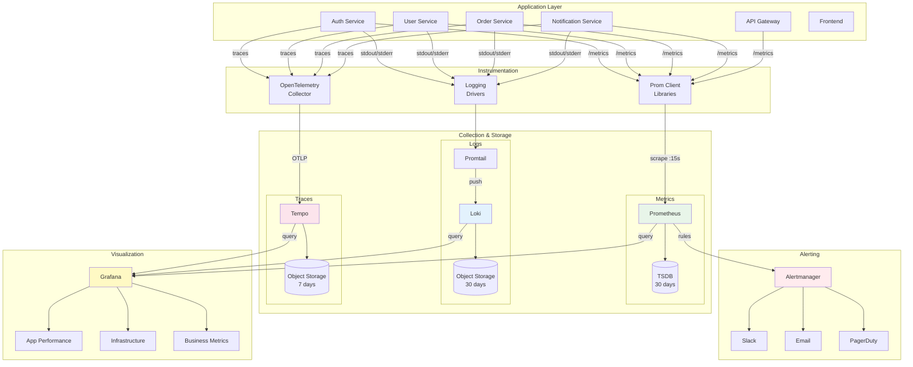

# 📊 Observability Stack - Complete Strategy

## Vue d'ensemble

Stack d'observabilité complète basée sur les trois piliers : Metrics (Prometheus), Logs (Loki), Traces (Tempo), le tout unifié dans Grafana.

## Architecture Observabilité



## 1. Metrics (Prometheus)

### Architecture Prometheus

```yaml
# Prometheus Kubernetes Deployment
apiVersion: apps/v1
kind: Deployment
metadata:
  name: prometheus
  namespace: monitoring
spec:
  replicas: 2  # HA mode
  selector:
    matchLabels:
      app: prometheus
  template:
    metadata:
      labels:
        app: prometheus
    spec:
      serviceAccountName: prometheus
      containers:
        - name: prometheus
          image: prom/prometheus:v2.45.0
          args:
            - '--config.file=/etc/prometheus/prometheus.yml'
            - '--storage.tsdb.path=/prometheus'
            - '--storage.tsdb.retention.time=30d'
            - '--storage.tsdb.retention.size=50GB'
            - '--web.enable-lifecycle'
            - '--web.enable-admin-api'
          ports:
            - containerPort: 9090
              name: http
          volumeMounts:
            - name: config
              mountPath: /etc/prometheus
            - name: storage
              mountPath: /prometheus
          resources:
            requests:
              cpu: 500m
              memory: 2Gi
            limits:
              cpu: 2000m
              memory: 4Gi
      volumes:
        - name: config
          configMap:
            name: prometheus-config
        - name: storage
          persistentVolumeClaim:
            claimName: prometheus-pvc
```

### Configuration Prometheus

```yaml
# prometheus.yml
global:
  scrape_interval: 15s
  evaluation_interval: 15s
  external_labels:
    cluster: 'k3s-prod'
    environment: 'production'

# Alertmanager configuration
alerting:
  alertmanagers:
    - static_configs:
        - targets: ['alertmanager:9093']

# Load rules
rule_files:
  - '/etc/prometheus/rules/*.yml'

# Scrape configurations
scrape_configs:
  # Kubernetes API Server
  - job_name: 'kubernetes-apiservers'
    kubernetes_sd_configs:
      - role: endpoints
    scheme: https
    tls_config:
      ca_file: /var/run/secrets/kubernetes.io/serviceaccount/ca.crt
    bearer_token_file: /var/run/secrets/kubernetes.io/serviceaccount/token
    relabel_configs:
      - source_labels: [__meta_kubernetes_namespace, __meta_kubernetes_service_name, __meta_kubernetes_endpoint_port_name]
        action: keep
        regex: default;kubernetes;https

  # Kubernetes Nodes
  - job_name: 'kubernetes-nodes'
    kubernetes_sd_configs:
      - role: node
    scheme: https
    tls_config:
      ca_file: /var/run/secrets/kubernetes.io/serviceaccount/ca.crt
    bearer_token_file: /var/run/secrets/kubernetes.io/serviceaccount/token
    relabel_configs:
      - action: labelmap
        regex: __meta_kubernetes_node_label_(.+)

  # Kubernetes Pods
  - job_name: 'kubernetes-pods'
    kubernetes_sd_configs:
      - role: pod
    relabel_configs:
      - source_labels: [__meta_kubernetes_pod_annotation_prometheus_io_scrape]
        action: keep
        regex: true
      - source_labels: [__meta_kubernetes_pod_annotation_prometheus_io_path]
        action: replace
        target_label: __metrics_path__
        regex: (.+)
      - source_labels: [__address__, __meta_kubernetes_pod_annotation_prometheus_io_port]
        action: replace
        regex: ([^:]+)(?::\d+)?;(\d+)
        replacement: $1:$2
        target_label: __address__
      - action: labelmap
        regex: __meta_kubernetes_pod_label_(.+)
      - source_labels: [__meta_kubernetes_namespace]
        action: replace
        target_label: kubernetes_namespace
      - source_labels: [__meta_kubernetes_pod_name]
        action: replace
        target_label: kubernetes_pod_name

  # Application Services (annotated)
  - job_name: 'auth-service'
    static_configs:
      - targets: ['auth-service.production:3001']
        labels:
          service: 'auth'
          tier: 'backend'

  - job_name: 'user-service'
    static_configs:
      - targets: ['user-service.production:3002']
        labels:
          service: 'user'
          tier: 'backend'

  # PostgreSQL Exporter
  - job_name: 'postgresql'
    static_configs:
      - targets: ['postgres-exporter.data:9187']

  # Redis Exporter
  - job_name: 'redis'
    static_configs:
      - targets: ['redis-exporter.data:9121']

  # Linkerd Service Mesh
  - job_name: 'linkerd-controller'
    kubernetes_sd_configs:
      - role: pod
        namespaces:
          names: ['linkerd']
    relabel_configs:
      - source_labels: [__meta_kubernetes_pod_label_linkerd_io_control_plane_component]
        action: keep
        regex: .+

  # Node Exporter (system metrics)
  - job_name: 'node-exporter'
    kubernetes_sd_configs:
      - role: pod
    relabel_configs:
      - source_labels: [__meta_kubernetes_pod_label_app]
        action: keep
        regex: node-exporter
```

### Golden Signals (SRE Metrics)

```yaml
# Recording rules for Golden Signals
groups:
  - name: golden_signals
    interval: 30s
    rules:
      # Latency
      - record: service:request_duration_seconds:p50
        expr: |
          histogram_quantile(0.50,
            sum(rate(http_request_duration_seconds_bucket[5m])) by (le, service)
          )
      
      - record: service:request_duration_seconds:p95
        expr: |
          histogram_quantile(0.95,
            sum(rate(http_request_duration_seconds_bucket[5m])) by (le, service)
          )
      
      - record: service:request_duration_seconds:p99
        expr: |
          histogram_quantile(0.99,
            sum(rate(http_request_duration_seconds_bucket[5m])) by (le, service)
          )
      
      # Traffic
      - record: service:requests:rate
        expr: |
          sum(rate(http_requests_total[5m])) by (service)
      
      # Errors
      - record: service:request_errors:rate
        expr: |
          sum(rate(http_requests_total{status_code=~"5.."}[5m])) by (service)
      
      - record: service:error_rate:ratio
        expr: |
          sum(rate(http_requests_total{status_code=~"5.."}[5m])) by (service)
          /
          sum(rate(http_requests_total[5m])) by (service)
      
      # Saturation
      - record: instance:cpu:utilization
        expr: |
          100 - (avg by (instance) (rate(node_cpu_seconds_total{mode="idle"}[5m])) * 100)
      
      - record: instance:memory:utilization
        expr: |
          100 - ((node_memory_MemAvailable_bytes / node_memory_MemTotal_bytes) * 100)
```

### Instrumentation Application

```javascript
// Node.js auth-service metrics example
const promClient = require('prom-client');
const express = require('express');
const app = express();

// Create Registry
const register = new promClient.Registry();

// Add default metrics (CPU, Memory, etc.)
promClient.collectDefaultMetrics({
  register,
  prefix: 'auth_service_',
  gcDurationBuckets: [0.001, 0.01, 0.1, 1, 2, 5]
});

// Custom metrics
const httpRequestDuration = new promClient.Histogram({
  name: 'http_request_duration_seconds',
  help: 'Duration of HTTP requests in seconds',
  labelNames: ['method', 'route', 'status_code'],
  buckets: [0.001, 0.01, 0.05, 0.1, 0.5, 1, 2, 5]
});

const httpRequestsTotal = new promClient.Counter({
  name: 'http_requests_total',
  help: 'Total number of HTTP requests',
  labelNames: ['method', 'route', 'status_code']
});

const activeUsers = new promClient.Gauge({
  name: 'active_users_total',
  help: 'Total number of active users (logged in)'
});

const authAttempts = new promClient.Counter({
  name: 'auth_attempts_total',
  help: 'Total authentication attempts',
  labelNames: ['status'] // success, failure, locked
});

const databaseConnections = new promClient.Gauge({
  name: 'database_connections_active',
  help: 'Number of active database connections'
});

register.registerMetric(httpRequestDuration);
register.registerMetric(httpRequestsTotal);
register.registerMetric(activeUsers);
register.registerMetric(authAttempts);
register.registerMetric(databaseConnections);

// Middleware to track requests
app.use((req, res, next) => {
  const start = Date.now();
  
  res.on('finish', () => {
    const duration = (Date.now() - start) / 1000;
    const route = req.route?.path || req.path;
    
    httpRequestDuration.observe(
      { method: req.method, route, status_code: res.statusCode },
      duration
    );
    
    httpRequestsTotal.inc({
      method: req.method,
      route,
      status_code: res.statusCode
    });
  });
  
  next();
});

// Expose metrics endpoint
app.get('/metrics', async (req, res) => {
  res.set('Content-Type', register.contentType);
  res.end(await register.metrics());
});

// Update active users periodically
setInterval(async () => {
  const count = await getActiveUsersCount(); // Your DB query
  activeUsers.set(count);
}, 60000); // Every minute

// Track auth attempts
app.post('/api/auth/login', async (req, res) => {
  try {
    const result = await authenticateUser(req.body);
    authAttempts.inc({ status: 'success' });
    res.json(result);
  } catch (error) {
    if (error.code === 'LOCKED') {
      authAttempts.inc({ status: 'locked' });
    } else {
      authAttempts.inc({ status: 'failure' });
    }
    res.status(401).json({ error: error.message });
  }
});

module.exports = { register };
```

## 2. Logs (Loki)

### Architecture Loki

```yaml
# Loki Deployment
apiVersion: apps/v1
kind: StatefulSet
metadata:
  name: loki
  namespace: monitoring
spec:
  serviceName: loki
  replicas: 3
  selector:
    matchLabels:
      app: loki
  template:
    metadata:
      labels:
        app: loki
    spec:
      containers:
        - name: loki
          image: grafana/loki:2.9.0
          args:
            - -config.file=/etc/loki/loki.yaml
          ports:
            - containerPort: 3100
              name: http
          volumeMounts:
            - name: config
              mountPath: /etc/loki
            - name: storage
              mountPath: /loki
          resources:
            requests:
              cpu: 200m
              memory: 512Mi
            limits:
              cpu: 1000m
              memory: 2Gi
      volumes:
        - name: config
          configMap:
            name: loki-config
  volumeClaimTemplates:
    - metadata:
        name: storage
      spec:
        accessModes: ["ReadWriteOnce"]
        resources:
          requests:
            storage: 50Gi
```

### Configuration Loki

```yaml
# loki.yaml
auth_enabled: false

server:
  http_listen_port: 3100
  grpc_listen_port: 9096

ingester:
  lifecycler:
    ring:
      kvstore:
        store: inmemory
      replication_factor: 1
  chunk_idle_period: 5m
  chunk_retain_period: 30s
  max_chunk_age: 1h

schema_config:
  configs:
    - from: 2023-01-01
      store: boltdb-shipper
      object_store: s3
      schema: v11
      index:
        prefix: index_
        period: 24h

storage_config:
  boltdb_shipper:
    active_index_directory: /loki/index
    cache_location: /loki/cache
    shared_store: s3
  
  aws:
    s3: s3://minio:9000/loki
    s3forcepathstyle: true
    bucketnames: loki
    access_key_id: ${MINIO_ACCESS_KEY}
    secret_access_key: ${MINIO_SECRET_KEY}

limits_config:
  enforce_metric_name: false
  reject_old_samples: true
  reject_old_samples_max_age: 168h
  max_entries_limit_per_query: 5000
  max_query_length: 721h # 30 days

chunk_store_config:
  max_look_back_period: 720h # 30 days

table_manager:
  retention_deletes_enabled: true
  retention_period: 720h # 30 days

compactor:
  working_directory: /loki/compactor
  shared_store: s3
  compaction_interval: 10m
```

### Promtail (Log Collector)

```yaml
# Promtail DaemonSet
apiVersion: apps/v1
kind: DaemonSet
metadata:
  name: promtail
  namespace: monitoring
spec:
  selector:
    matchLabels:
      app: promtail
  template:
    metadata:
      labels:
        app: promtail
    spec:
      serviceAccountName: promtail
      containers:
        - name: promtail
          image: grafana/promtail:2.9.0
          args:
            - -config.file=/etc/promtail/promtail.yaml
          volumeMounts:
            - name: config
              mountPath: /etc/promtail
            - name: varlog
              mountPath: /var/log
              readOnly: true
            - name: varlibdockercontainers
              mountPath: /var/lib/docker/containers
              readOnly: true
          resources:
            requests:
              cpu: 50m
              memory: 128Mi
            limits:
              cpu: 200m
              memory: 256Mi
      volumes:
        - name: config
          configMap:
            name: promtail-config
        - name: varlog
          hostPath:
            path: /var/log
        - name: varlibdockercontainers
          hostPath:
            path: /var/lib/docker/containers
```

### Structured Logging (Application)

```javascript
// Node.js structured logging with Winston
const winston = require('winston');

const logger = winston.createLogger({
  level: process.env.LOG_LEVEL || 'info',
  format: winston.format.combine(
    winston.format.timestamp(),
    winston.format.errors({ stack: true }),
    winston.format.json()
  ),
  defaultMeta: {
    service: 'auth-service',
    environment: process.env.NODE_ENV,
    version: process.env.APP_VERSION
  },
  transports: [
    new winston.transports.Console({
      format: winston.format.combine(
        winston.format.colorize(),
        winston.format.simple()
      )
    })
  ]
});

// Usage with correlation ID
app.use((req, res, next) => {
  req.correlationId = req.headers['x-correlation-id'] || uuid.v4();
  res.setHeader('X-Correlation-ID', req.correlationId);
  next();
});

app.post('/api/auth/login', async (req, res) => {
  logger.info('Login attempt', {
    correlationId: req.correlationId,
    email: req.body.email,
    ip: req.ip,
    userAgent: req.headers['user-agent']
  });
  
  try {
    const result = await authenticateUser(req.body);
    
    logger.info('Login successful', {
      correlationId: req.correlationId,
      userId: result.userId,
      email: req.body.email
    });
    
    res.json(result);
  } catch (error) {
    logger.error('Login failed', {
      correlationId: req.correlationId,
      email: req.body.email,
      error: error.message,
      stack: error.stack
    });
    
    res.status(401).json({ error: 'Authentication failed' });
  }
});
```

### LogQL Queries (Exemples)

```logql
# All logs from auth-service in last hour
{app="auth-service"} |= "" [1h]

# Error logs only
{app="auth-service"} |= "level=error"

# Failed login attempts
{app="auth-service"} |= "Login failed" | json | email != ""

# Count errors by service (last 5min)
sum(rate({app=~".+"} |= "level=error" [5m])) by (app)

# Latency from logs (if logged)
avg_over_time({app="auth-service"} | json | unwrap duration [5m])

# Search by correlation ID
{app=~".+"} |= "correlationId=abc123"
```

## 3. Traces (Tempo)

### Architecture Tempo

```yaml
# Tempo Deployment
apiVersion: apps/v1
kind: Deployment
metadata:
  name: tempo
  namespace: monitoring
spec:
  replicas: 2
  selector:
    matchLabels:
      app: tempo
  template:
    metadata:
      labels:
        app: tempo
    spec:
      containers:
        - name: tempo
          image: grafana/tempo:2.2.0
          args:
            - -config.file=/etc/tempo/tempo.yaml
          ports:
            - containerPort: 3200
              name: http
            - containerPort: 4317
              name: otlp-grpc
            - containerPort: 4318
              name: otlp-http
          volumeMounts:
            - name: config
              mountPath: /etc/tempo
            - name: storage
              mountPath: /var/tempo
          resources:
            requests:
              cpu: 200m
              memory: 512Mi
            limits:
              cpu: 1000m
              memory: 2Gi
      volumes:
        - name: config
          configMap:
            name: tempo-config
        - name: storage
          persistentVolumeClaim:
            claimName: tempo-pvc
```

### Distributed Tracing (OpenTelemetry)

```javascript
// Node.js OpenTelemetry instrumentation
const { NodeSDK } = require('@opentelemetry/sdk-node');
const { getNodeAutoInstrumentations } = require('@opentelemetry/auto-instrumentations-node');
const { OTLPTraceExporter } = require('@opentelemetry/exporter-trace-otlp-grpc');
const { Resource } = require('@opentelemetry/resources');
const { SemanticResourceAttributes } = require('@opentelemetry/semantic-conventions');

// Configure SDK
const sdk = new NodeSDK({
  resource: new Resource({
    [SemanticResourceAttributes.SERVICE_NAME]: 'auth-service',
    [SemanticResourceAttributes.SERVICE_VERSION]: process.env.APP_VERSION,
    [SemanticResourceAttributes.DEPLOYMENT_ENVIRONMENT]: process.env.NODE_ENV
  }),
  traceExporter: new OTLPTraceExporter({
    url: 'http://tempo.monitoring:4317'
  }),
  instrumentations: [
    getNodeAutoInstrumentations({
      '@opentelemetry/instrumentation-fs': {
        enabled: false // Disable fs instrumentation (too verbose)
      }
    })
  ]
});

sdk.start();

// Manual span creation for business logic
const { trace } = require('@opentelemetry/api');

app.post('/api/auth/login', async (req, res) => {
  const tracer = trace.getTracer('auth-service');
  
  const span = tracer.startSpan('authenticate_user', {
    attributes: {
      'user.email': req.body.email,
      'http.method': req.method,
      'http.url': req.url
    }
  });
  
  try {
    // Validate credentials
    const validateSpan = tracer.startSpan('validate_credentials', { parent: span });
    const user = await User.findByEmail(req.body.email);
    const isValid = await bcrypt.compare(req.body.password, user.password);
    validateSpan.end();
    
    if (!isValid) {
      span.setStatus({ code: 2, message: 'Invalid credentials' });
      throw new Error('Invalid credentials');
    }
    
    // Generate token
    const tokenSpan = tracer.startSpan('generate_token', { parent: span });
    const token = jwt.sign({ userId: user.id }, JWT_SECRET);
    tokenSpan.end();
    
    // Update last login
    const updateSpan = tracer.startSpan('update_last_login', { parent: span });
    await user.updateLastLogin();
    updateSpan.end();
    
    span.setStatus({ code: 1 }); // OK
    res.json({ token, user: { id: user.id, email: user.email } });
  } catch (error) {
    span.recordException(error);
    span.setStatus({ code: 2, message: error.message });
    res.status(401).json({ error: error.message });
  } finally {
    span.end();
  }
});
```

## 4. Alerting (Alertmanager)

### Alert Rules

```yaml
groups:
  - name: application_alerts
    rules:
      # High Error Rate
      - alert: HighErrorRate
        expr: |
          service:error_rate:ratio > 0.05
        for: 5m
        labels:
          severity: critical
          team: backend
        annotations:
          summary: "High error rate on {{ $labels.service }}"
          description: "Error rate is {{ $value | humanizePercentage }} for service {{ $labels.service }}"
      
      # High Latency
      - alert: HighLatency
        expr: |
          service:request_duration_seconds:p95 > 1
        for: 10m
        labels:
          severity: warning
          team: backend
        annotations:
          summary: "High latency on {{ $labels.service }}"
          description: "P95 latency is {{ $value }}s for service {{ $labels.service }}"
      
      # Low Traffic (potential issue)
      - alert: LowTraffic
        expr: |
          service:requests:rate < 1
        for: 15m
        labels:
          severity: warning
          team: backend
        annotations:
          summary: "Abnormally low traffic on {{ $labels.service }}"
      
      # Service Down
      - alert: ServiceDown
        expr: |
          up{job=~"auth-service|user-service"} == 0
        for: 1m
        labels:
          severity: critical
          team: backend
        annotations:
          summary: "Service {{ $labels.job }} is down"
          description: "Service {{ $labels.job }} on {{ $labels.instance }} has been down for 1 minute"
      
      # High Memory Usage
      - alert: HighMemoryUsage
        expr: |
          instance:memory:utilization > 90
        for: 10m
        labels:
          severity: warning
          team: infra
        annotations:
          summary: "High memory usage on {{ $labels.instance }}"
          description: "Memory usage is {{ $value }}% on {{ $labels.instance }}"
      
      # Disk Space Low
      - alert: DiskSpaceLow
        expr: |
          (node_filesystem_avail_bytes / node_filesystem_size_bytes) * 100 < 15
        for: 10m
        labels:
          severity: warning
          team: infra
        annotations:
          summary: "Low disk space on {{ $labels.instance }}"
          description: "Only {{ $value }}% disk space available on {{ $labels.instance }}"
```

### Alertmanager Configuration

```yaml
# alertmanager.yml
global:
  resolve_timeout: 5m
  slack_api_url: ${SLACK_WEBHOOK_URL}

route:
  group_by: ['alertname', 'cluster', 'service']
  group_wait: 10s
  group_interval: 10s
  repeat_interval: 12h
  receiver: 'default'
  routes:
    # Critical alerts to PagerDuty + Slack
    - match:
        severity: critical
      receiver: 'pagerduty-critical'
      continue: true
    
    # Critical alerts also to Slack
    - match:
        severity: critical
      receiver: 'slack-critical'
    
    # Warning alerts to Slack only
    - match:
        severity: warning
      receiver: 'slack-warnings'
    
    # Info alerts to email
    - match:
        severity: info
      receiver: 'email-team'

receivers:
  - name: 'default'
    slack_configs:
      - channel: '#alerts'
        title: 'Alert: {{ .GroupLabels.alertname }}'
        text: '{{ range .Alerts }}{{ .Annotations.description }}{{ end }}'

  - name: 'pagerduty-critical'
    pagerduty_configs:
      - service_key: ${PAGERDUTY_SERVICE_KEY}
        description: '{{ .GroupLabels.alertname }}'

  - name: 'slack-critical'
    slack_configs:
      - channel: '#alerts-critical'
        color: 'danger'
        title: '🚨 CRITICAL: {{ .GroupLabels.alertname }}'
        text: |
          *Summary:* {{ range .Alerts }}{{ .Annotations.summary }}{{ end }}
          *Description:* {{ range .Alerts }}{{ .Annotations.description }}{{ end }}
          *Severity:* {{ .CommonLabels.severity }}
          *Team:* {{ .CommonLabels.team }}

  - name: 'slack-warnings'
    slack_configs:
      - channel: '#alerts'
        color: 'warning'
        title: '⚠️ WARNING: {{ .GroupLabels.alertname }}'
        text: '{{ range .Alerts }}{{ .Annotations.description }}{{ end }}'

  - name: 'email-team'
    email_configs:
      - to: 'devops-team@example.com'
        from: 'alertmanager@example.com'
        smarthost: 'smtp.example.com:587'
        auth_username: ${SMTP_USERNAME}
        auth_password: ${SMTP_PASSWORD}
```

## 5. Grafana Dashboards

### Dashboard: Application Performance

```json
{
  "dashboard": {
    "title": "Application Performance",
    "panels": [
      {
        "title": "Request Rate",
        "targets": [
          {
            "expr": "sum(rate(http_requests_total[5m])) by (service)",
            "legendFormat": "{{ service }}"
          }
        ],
        "type": "graph"
      },
      {
        "title": "Latency (P50, P95, P99)",
        "targets": [
          {
            "expr": "service:request_duration_seconds:p50",
            "legendFormat": "P50 - {{ service }}"
          },
          {
            "expr": "service:request_duration_seconds:p95",
            "legendFormat": "P95 - {{ service }}"
          },
          {
            "expr": "service:request_duration_seconds:p99",
            "legendFormat": "P99 - {{ service }}"
          }
        ],
        "type": "graph"
      },
      {
        "title": "Error Rate",
        "targets": [
          {
            "expr": "service:error_rate:ratio * 100",
            "legendFormat": "{{ service }}"
          }
        ],
        "type": "graph"
      },
      {
        "title": "Active Users",
        "targets": [
          {
            "expr": "active_users_total"
          }
        ],
        "type": "stat"
      }
    ]
  }
}
```

---

**Document Version** : 1.0  
**Dernière Mise à Jour** : 2026-02-12  
**Auteur** : Équipe Observabilité
