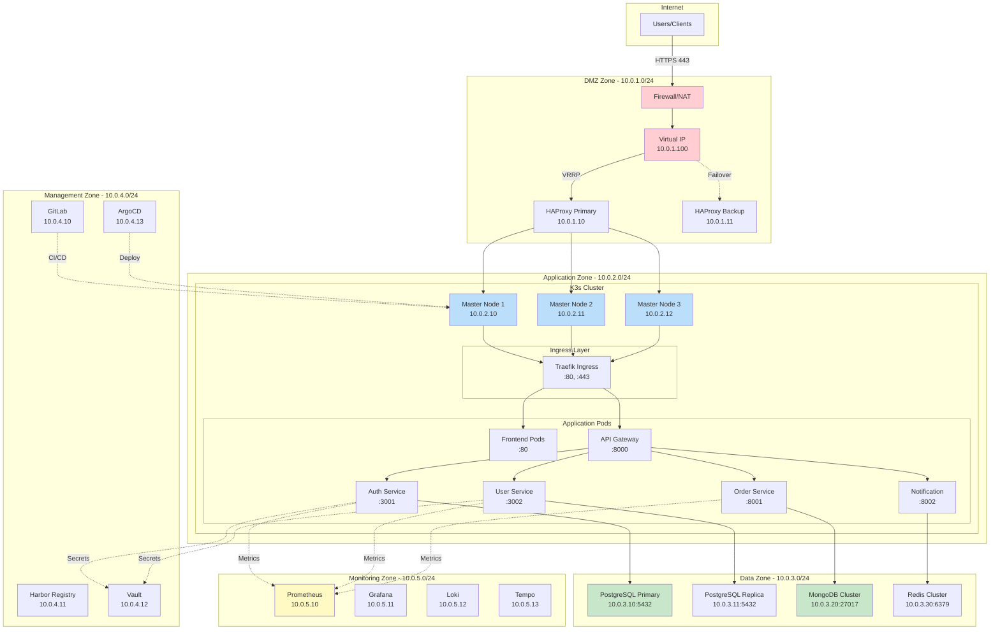

# 🌐 Network Topology & Security

## Vue d'ensemble

Architecture réseau détaillée pour le déploiement on-premise avec zones de sécurité DMZ, réseau interne, et isolation des services.

## Architecture Réseau Globale



## Zones de Sécurité

### Zone 1: DMZ (10.0.1.0/24)
**Purpose** : Point d'entrée depuis Internet

| Composant | IP | Ports | Description |
|-----------|-----|-------|-------------|
| **Firewall** | 10.0.1.1 | - | Pare-feu externe |
| **HAProxy Primary** | 10.0.1.10 | 80, 443, 8404 (stats) | Load balancer principal |
| **HAProxy Backup** | 10.0.1.11 | 80, 443, 8404 | Load balancer backup |
| **Virtual IP** | 10.0.1.100 | - | IP flottante (VRRP) |

**Règles Firewall DMZ** :
```
# Entrantes autorisées
ACCEPT tcp from 0.0.0.0/0 to 10.0.1.100 port 443  # HTTPS public
ACCEPT tcp from VPN_NETWORK to 10.0.1.100 port 80  # HTTP interne

# Sortantes autorisées
ACCEPT tcp from 10.0.1.0/24 to 10.0.2.0/24 port 80,443  # Vers K3s
ACCEPT tcp from 10.0.1.0/24 to 10.0.1.0/24 port 112  # VRRP

# Bloquer tout le reste
DROP all from any to any
```

### Zone 2: Application (10.0.2.0/24)
**Purpose** : Cluster Kubernetes et applications

| Composant | IP | Ports | Description |
|-----------|-----|-------|-------------|
| **K3s Master 1** | 10.0.2.10 | 6443, 10250, 2379-2380 | Control plane + worker |
| **K3s Master 2** | 10.0.2.11 | 6443, 10250, 2379-2380 | Control plane + worker |
| **K3s Master 3** | 10.0.2.12 | 6443, 10250, 2379-2380 | Control plane + worker |

**Network Policies K3s** :
```yaml
# Default deny all ingress
apiVersion: networking.k8s.io/v1
kind: NetworkPolicy
metadata:
  name: default-deny-ingress
  namespace: production
spec:
  podSelector: {}
  policyTypes:
    - Ingress

# Allow ingress from Traefik
apiVersion: networking.k8s.io/v1
kind: NetworkPolicy
metadata:
  name: allow-from-ingress
  namespace: production
spec:
  podSelector:
    matchLabels:
      app: api-gateway
  ingress:
    - from:
        - namespaceSelector:
            matchLabels:
              name: kube-system
        - podSelector:
            matchLabels:
              app.kubernetes.io/name: traefik
      ports:
        - protocol: TCP
          port: 8000
```

### Zone 3: Data (10.0.3.0/24)
**Purpose** : Bases de données et stockage

| Composant | IP | Ports | Description |
|-----------|-----|-------|-------------|
| **PostgreSQL Primary** | 10.0.3.10 | 5432 | Base principale |
| **PostgreSQL Replica** | 10.0.3.11 | 5432 | Réplica lecture |
| **MongoDB Primary** | 10.0.3.20 | 27017 | MongoDB principal |
| **MongoDB Secondary** | 10.0.3.21 | 27017 | MongoDB secondaire |
| **Redis Node 1** | 10.0.3.30 | 6379 | Redis cluster master |
| **Redis Node 2** | 10.0.3.31 | 6379 | Redis cluster replica |

**Règles Firewall Data** :
```
# Autoriser depuis Application zone uniquement
ACCEPT tcp from 10.0.2.0/24 to 10.0.3.10 port 5432  # PostgreSQL
ACCEPT tcp from 10.0.2.0/24 to 10.0.3.20 port 27017 # MongoDB
ACCEPT tcp from 10.0.2.0/24 to 10.0.3.30 port 6379  # Redis

# Réplication interne
ACCEPT tcp from 10.0.3.10 to 10.0.3.11 port 5432    # PG replication
ACCEPT tcp from 10.0.3.20 to 10.0.3.21 port 27017   # Mongo replication

# Bloquer accès externe
DROP tcp from 0.0.0.0/0 to 10.0.3.0/24
```

### Zone 4: Management (10.0.4.0/24)
**Purpose** : Outils DevOps et CI/CD

| Composant | IP | Ports | Description |
|-----------|-----|-------|-------------|
| **GitLab** | 10.0.4.10 | 80, 443, 22 | Git + CI/CD |
| **Harbor** | 10.0.4.11 | 80, 443 | Container registry |
| **Vault** | 10.0.4.12 | 8200 | Secrets management |
| **ArgoCD** | 10.0.4.13 | 8080, 443 | GitOps deployment |

### Zone 5: Monitoring (10.0.5.0/24)
**Purpose** : Observabilité et monitoring

| Composant | IP | Ports | Description |
|-----------|-----|-------|-------------|
| **Prometheus** | 10.0.5.10 | 9090 | Metrics collection |
| **Grafana** | 10.0.5.11 | 3000 | Visualization |
| **Loki** | 10.0.5.12 | 3100 | Logs aggregation |
| **Tempo** | 10.0.5.13 | 3200 | Distributed tracing |

## Flux Réseau

### 1. User Request Flow (Production)
```
Internet User
  ↓ HTTPS (443)
Firewall (10.0.1.1)
  ↓ Forward
Virtual IP (10.0.1.100)
  ↓ VRRP
HAProxy Primary (10.0.1.10)
  ↓ Round-robin
K3s Master Nodes (10.0.2.10-12)
  ↓ Kube-proxy
Traefik Ingress
  ↓ Route by hostname
API Gateway Pod
  ↓ Service mesh (mTLS)
Microservice Pod (auth/user/order)
  ↓ Connection pool
Database (10.0.3.x)
```

### 2. Deployment Flow
```
Developer Workstation
  ↓ git push
GitLab (10.0.4.10)
  ↓ Trigger CI
GitLab Runner (10.0.2.x)
  ↓ Build image
Harbor Registry (10.0.4.11)
  ↓ Update manifest
Git Repository (GitLab)
  ↓ Watch
ArgoCD (10.0.4.13)
  ↓ Apply
K3s API Server (10.0.2.10:6443)
  ↓ Schedule
Pod on Worker Node
```

### 3. Monitoring Flow
```
Application Pod
  ↓ /metrics endpoint
Prometheus (10.0.5.10)
  ↓ Scrape every 15s
TSDB Storage
  ↓ Query
Grafana (10.0.5.11)
  ↓ Display
User Dashboard
```

## Sécurité Réseau

### 1. Défense en Profondeur

```mermaid
graph LR
    A[Internet] --> B[Firewall L3/L4]
    B --> C[WAF L7]
    C --> D[Load Balancer]
    D --> E[Ingress Controller]
    E --> F[Service Mesh mTLS]
    F --> G[Network Policies]
    G --> H[Application]
    H --> I[Database Firewall]
    
    style A fill:#ffebee
    style B fill:#ffcdd2
    style C fill:#ef9a9a
    style D fill:#e57373
    style E fill:#ef5350
    style F fill:#f44336
    style G fill:#e53935
    style H fill:#d32f2f
    style I fill:#c62828
```



### 2. Isolation Réseau K3s

```yaml
# Namespace Production - Strict isolation
apiVersion: v1
kind: Namespace
metadata:
  name: production
  labels:
    name: production
    environment: prod

---
# Network Policy: Default Deny All
apiVersion: networking.k8s.io/v1
kind: NetworkPolicy
metadata:
  name: default-deny-all
  namespace: production
spec:
  podSelector: {}
  policyTypes:
    - Ingress
    - Egress

---
# Network Policy: Allow DNS
apiVersion: networking.k8s.io/v1
kind: NetworkPolicy
metadata:
  name: allow-dns
  namespace: production
spec:
  podSelector: {}
  policyTypes:
    - Egress
  egress:
    - to:
        - namespaceSelector:
            matchLabels:
              name: kube-system
      ports:
        - protocol: UDP
          port: 53

---
# Network Policy: Auth Service can access PostgreSQL
apiVersion: networking.k8s.io/v1
kind: NetworkPolicy
metadata:
  name: auth-to-postgres
  namespace: production
spec:
  podSelector:
    matchLabels:
      app: auth-service
  policyTypes:
    - Egress
  egress:
    - to:
        - podSelector:
            matchLabels:
              app: postgresql
      ports:
        - protocol: TCP
          port: 5432

---
# Network Policy: API Gateway can access all services
apiVersion: networking.k8s.io/v1
kind: NetworkPolicy
metadata:
  name: gateway-to-services
  namespace: production
spec:
  podSelector:
    matchLabels:
      app: api-gateway
  policyTypes:
    - Egress
  egress:
    - to:
        - podSelector:
            matchLabels:
              tier: backend
      ports:
        - protocol: TCP
          port: 3000
        - protocol: TCP
          port: 8000
```

### 3. TLS/SSL Configuration

#### Traefik Ingress TLS
```yaml
apiVersion: traefik.containo.us/v1alpha1
kind: IngressRoute
metadata:
  name: api-gateway-secure
  namespace: production
spec:
  entryPoints:
    - websecure
  routes:
    - match: Host(`api.example.com`)
      kind: Rule
      services:
        - name: api-gateway
          port: 8000
  tls:
    secretName: api-tls-cert
    options:
      name: tls-options
---
apiVersion: traefik.containo.us/v1alpha1
kind: TLSOption
metadata:
  name: tls-options
  namespace: production
spec:
  minVersion: VersionTLS13
  cipherSuites:
    - TLS_AES_256_GCM_SHA384
    - TLS_CHACHA20_POLY1305_SHA256
  curvePreferences:
    - CurveP521
    - CurveP384
```

### 4. Service Mesh mTLS (Linkerd)

```yaml
# Linkerd auto mTLS pour toutes les communications
apiVersion: v1
kind: Service
metadata:
  name: auth-service
  namespace: production
  annotations:
    linkerd.io/inject: enabled  # Auto mTLS
spec:
  selector:
    app: auth-service
  ports:
    - port: 3001
      targetPort: 3001
```

## Performance Réseau

### Latency Targets

| Path | P50 | P95 | P99 |
|------|-----|-----|-----|
| **Internet → Load Balancer** | < 10ms | < 20ms | < 50ms |
| **Load Balancer → Ingress** | < 2ms | < 5ms | < 10ms |
| **Ingress → Gateway** | < 1ms | < 2ms | < 5ms |
| **Gateway → Service** | < 1ms | < 2ms | < 5ms |
| **Service → Database** | < 5ms | < 10ms | < 20ms |

### Optimisations

#### 1. Connection Pooling
```javascript
// PostgreSQL Connection Pool
const { Pool } = require('pg');

const pool = new Pool({
  host: 'postgres.data.svc.cluster.local',
  port: 5432,
  database: 'authdb',
  user: 'authuser',
  password: process.env.DB_PASSWORD,
  max: 20,                    // Max connections
  idleTimeoutMillis: 30000,   // Close idle after 30s
  connectionTimeoutMillis: 2000
});
```

#### 2. Redis Caching
```javascript
// Redis client with cluster support
const Redis = require('ioredis');

const redis = new Redis.Cluster([
  { host: '10.0.3.30', port: 6379 },
  { host: '10.0.3.31', port: 6379 }
], {
  redisOptions: {
    password: process.env.REDIS_PASSWORD,
    connectTimeout: 1000
  },
  maxRedirections: 3
});
```

#### 3. HTTP Keep-Alive
```javascript
// Express with keep-alive
const express = require('express');
const app = express();

app.use((req, res, next) => {
  res.set('Connection', 'keep-alive');
  res.set('Keep-Alive', 'timeout=5, max=100');
  next();
});
```

## Monitoring Réseau

### Métriques Clés

```promql
# Latency entre services (Linkerd)
histogram_quantile(0.95,
  sum(rate(request_duration_ms_bucket[5m])) by (le, dst_service)
)

# Taux d'erreur réseau
rate(request_errors_total[5m])

# Connexions actives
sum(node_netstat_Tcp_CurrEstab) by (instance)

# Bande passante utilisée
rate(node_network_receive_bytes_total[5m])
rate(node_network_transmit_bytes_total[5m])
```

### Alertes Réseau

```yaml
groups:
  - name: network
    rules:
      - alert: HighNetworkLatency
        expr: |
          histogram_quantile(0.95,
            sum(rate(request_duration_ms_bucket[5m])) by (le)
          ) > 100
        for: 5m
        annotations:
          summary: "High network latency detected"
          
      - alert: NetworkErrorRate
        expr: |
          rate(request_errors_total[5m]) > 0.05
        for: 5m
        annotations:
          summary: "Network error rate > 5%"
```

## DNS Configuration

### Internal DNS (CoreDNS)
```yaml
apiVersion: v1
kind: ConfigMap
metadata:
  name: coredns
  namespace: kube-system
data:
  Corefile: |
    .:53 {
        errors
        health {
           lameduck 5s
        }
        ready
        kubernetes cluster.local in-addr.arpa ip6.arpa {
           pods insecure
           fallthrough in-addr.arpa ip6.arpa
           ttl 30
        }
        prometheus :9153
        forward . /etc/resolv.conf {
           max_concurrent 1000
        }
        cache 30
        loop
        reload
        loadbalance
    }
```

### Service Discovery
```yaml
# Exemple de service avec DNS interne
apiVersion: v1
kind: Service
metadata:
  name: auth-service
  namespace: production
spec:
  selector:
    app: auth-service
  ports:
    - port: 3001
      targetPort: 3001
# Accessible via: auth-service.production.svc.cluster.local:3001
```

## Troubleshooting Réseau

### Commandes Utiles

```bash
# Test connectivité depuis un pod
kubectl run -it --rm debug --image=nicolaka/netshoot --restart=Never -- bash

# Test DNS
nslookup auth-service.production.svc.cluster.local

# Test connexion service
curl -v http://auth-service.production.svc.cluster.local:3001/health

# Tracer route
traceroute auth-service.production.svc.cluster.local

# Check network policies
kubectl get networkpolicies -n production
kubectl describe networkpolicy default-deny-all -n production

# Monitor traffic (Linkerd)
linkerd tap deploy/auth-service -n production

# Check Service Mesh status
linkerd check

# View network stats
kubectl top nodes
kubectl top pods -n production
```

---

**Document Version** : 1.0  
**Dernière Mise à Jour** : 2026-02-12  
**Auteur** : Équipe Infrastructure
