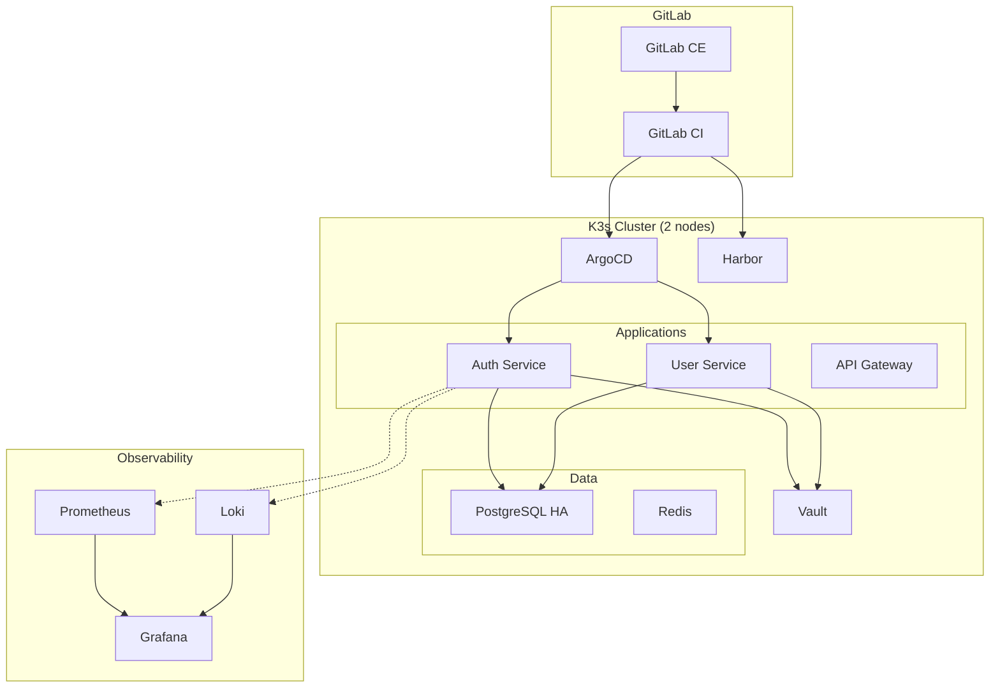
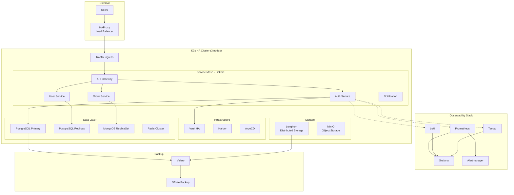

# 🎯 Recommendations & Final Stack

## Vue d'ensemble

Ce document synthétise les recommandations finales pour le stack technique DevOps microservices on-premise, basées sur l'analyse comparative complète.

## 📦 Stack Technique Recommandée

### Tableau Récapitulatif

| Catégorie | Outil Recommandé | Alternative | Justification |
|-----------|------------------|-------------|---------------|
| **Orchestration** | ✅ K3s | K8s vanilla, Docker Swarm | Léger, production-ready, coût minimal |
| **CI/CD** | ✅ GitLab CI | Jenkins, Drone CI | All-in-one, open-source, mature |
| **GitOps** | ✅ ArgoCD | Flux CD | UI intuitive, stable |
| **Registry** | ✅ Harbor | GitLab Registry | Sécurité, scanning intégré |
| **Secrets** | ✅ Vault | Sealed Secrets | Standard industrie, HA |
| **Service Mesh** | ✅ Linkerd | Istio, sans mesh | Plus léger, mTLS auto |
| **API Gateway** | ✅ Kong | Traefik, APISIX | Plugins riches, performant |
| **Monitoring** | ✅ Prometheus | VictoriaMetrics | Standard de facto |
| **Logs** | ✅ Loki | ELK Stack | Coût minimal, intégration Grafana |
| **Traces** | ✅ Tempo | Jaeger | Storage optimisé |
| **Visualization** | ✅ Grafana | Kibana | Unifié (metrics+logs+traces) |
| **Alerting** | ✅ Alertmanager | PagerDuty seul | Gratuit, intégré Prometheus |
| **Database** | ✅ PostgreSQL | MySQL, MariaDB | Robuste, features avancées |
| **Cache** | ✅ Redis | Memcached | Versatile (cache + queue) |
| **Load Balancer** | ✅ HAProxy | Nginx, Traefik | HA native, performant |
| **Backup** | ✅ Velero | Stash | Standard K8s backups |
| **Storage** | ✅ Longhorn | Rook-Ceph | Simple, intégré K3s |

---

## 🏆 Top Recommendations par Phase

### Phase 1 (POC) - Semaines 1-4

#### Must-Have
1. **GitLab CE** - Git + CI/CD + Registry tout-en-un
2. **Docker Compose** - Orchestration simple
3. **Prometheus + Grafana** - Monitoring basique
4. **PostgreSQL** - Base de données fiable
5. **Node.js + React** - Stack applicatif

#### Configuration Minimale
```yaml
# docker-compose.yml (POC)
version: '3.9'
services:
  gitlab:
    image: gitlab/gitlab-ce:latest
    # ...
  postgres:
    image: postgres:15-alpine
  redis:
    image: redis:7-alpine
  auth-service:
    build: ./services/auth-service
  prometheus:
    image: prom/prometheus:latest
  grafana:
    image: grafana/grafana:latest
```

**Coût** : €0-500  
**Risque** : Faible  
**Impact** : Validation faisabilité

---

### Phase 2 (MVP) - Semaines 5-16

#### Must-Have
1. **K3s Cluster** (2 nodes) - Orchestration production-ready
2. **ArgoCD** - GitOps deployments
3. **Harbor** - Registry sécurisé avec scanning
4. **Vault** - Secrets management
5. **Loki** - Logs centralisés
6. **PostgreSQL HA** - Patroni auto-failover

#### Architecture Cible MVP



**Coût** : €1,500-2,500  
**Risque** : Moyen  
**Impact** : Environnement staging complet

---

### Phase 3 (Production) - Semaines 17-32

#### Must-Have
1. **K3s HA Cluster** (3 nodes) - Haute disponibilité
2. **Linkerd** - Service mesh avec mTLS
3. **Tempo** - Distributed tracing
4. **Velero** - Backup & disaster recovery
5. **HAProxy** - Load balancing externe
6. **MinIO** - Object storage
7. **Longhorn** - Storage distribué

#### Architecture Cible Production



**Coût** : €4,000-6,000  
**Risque** : Faible (si Phase 2 réussie)  
**Impact** : Production sécurisée et résiliente

---

## 📋 Checklist de Décision par Outil

### Orchestration : K3s vs Kubernetes vs Docker Swarm

#### ✅ K3s (Recommandé)
**Pour** :
- ✅ 50% plus léger que K8s vanilla
- ✅ Certifié CNCF, production-ready
- ✅ Installation en 1 commande
- ✅ SQLite intégré pour HA simple
- ✅ Traefik inclus par défaut
- ✅ Batteries included (Helm, CoreDNS, etc.)

**Contre** :
- ⚠️ Moins de features que K8s (pas critique)
- ⚠️ Communauté plus petite que K8s

**Score** : 9/10

#### ⚠️ Kubernetes vanilla
**Pour** :
- ✅ Standard industrie
- ✅ Communauté massive
- ✅ Maximum de features

**Contre** :
- ❌ Setup complexe (kubeadm)
- ❌ Consommation ressources élevée
- ❌ Etcd externe requis pour HA

**Score** : 7/10

#### ❌ Docker Swarm
**Pour** :
- ✅ Simple à setup
- ✅ Intégré Docker

**Contre** :
- ❌ Écosystème limité
- ❌ Futur incertain
- ❌ Pas de Helm, pas d'Operators

**Score** : 4/10

**Décision** : ✅ **K3s** pour ratio simplicité/puissance optimal

---

### CI/CD : GitLab CI vs Jenkins vs GitHub Actions

Voir [ci-cd-comparison.md](../04-tools-comparison/ci-cd-comparison.md) pour analyse complète.

**Décision** : ✅ **GitLab CI** (all-in-one, €0, mature)

---

### Service Mesh : Linkerd vs Istio vs Sans Mesh

#### ✅ Linkerd (Recommandé Phase 3)
**Pour** :
- ✅ 10x plus léger qu'Istio
- ✅ Setup en 2 minutes
- ✅ mTLS automatique sans config
- ✅ Observability native (golden metrics)
- ✅ Latency overhead < 1ms

**Contre** :
- ⚠️ Moins de features qu'Istio (mais suffisant)

**Score** : 9/10  
**Quand** : Phase 3 Production

#### ⚠️ Istio
**Pour** :
- ✅ Feature-rich (traffic management avancé)
- ✅ Grande communauté

**Contre** :
- ❌ Complexe à configurer
- ❌ Gourmand en ressources (200MB+ par sidecar)
- ❌ Latency overhead 3-5ms

**Score** : 6/10  
**Quand** : Si besoins très avancés

#### ✅ Sans Service Mesh (Phase 1-2)
**Pour** :
- ✅ Simple
- ✅ Pas d'overhead

**Contre** :
- ❌ Pas de mTLS automatique
- ❌ Observability manuelle

**Score** : 7/10  
**Quand** : POC et MVP

**Décision** : 
- Phase 1-2 : ✅ **Sans mesh**
- Phase 3 : ✅ **Linkerd**

---

### Monitoring : Prometheus vs VictoriaMetrics vs Thanos

#### ✅ Prometheus (Recommandé)
**Pour** :
- ✅ Standard de facto (90%+ adoption)
- ✅ PromQL puissant
- ✅ Écosystème énorme (exporters, alerting)
- ✅ Grafana integration native

**Contre** :
- ⚠️ Rétention limitée (30 jours recommandé)
- ⚠️ Pas de clustering natif

**Score** : 9/10

#### ⚠️ VictoriaMetrics
**Pour** :
- ✅ 7x moins de storage que Prometheus
- ✅ Rétention longue efficace
- ✅ Compatible PromQL

**Contre** :
- ⚠️ Moins mature
- ⚠️ Communauté plus petite

**Score** : 8/10  
**Quand** : Si scaling issues Prometheus

#### ⚠️ Thanos
**Pour** :
- ✅ Rétention illimitée
- ✅ Multi-cluster

**Contre** :
- ❌ Complexité élevée
- ❌ Dépendance object storage

**Score** : 6/10  
**Quand** : Multi-cluster future

**Décision** : ✅ **Prometheus** (suffisant, standard)

---

### Logs : Loki vs ELK Stack vs Splunk

#### ✅ Loki (Recommandé)
**Pour** :
- ✅ Coût storage 10x moins qu'ELK
- ✅ Intégration parfaite Grafana
- ✅ LogQL similaire PromQL
- ✅ Pas d'indexation full-text (économie)

**Contre** :
- ⚠️ Search moins puissant qu'ELK
- ⚠️ Pas de parsing avancé par défaut

**Score** : 9/10  
**Coût** : €0

#### ⚠️ ELK Stack (Elasticsearch + Logstash + Kibana)
**Pour** :
- ✅ Search très puissant
- ✅ Features riches
- ✅ Mature

**Contre** :
- ❌ Consommation ressources élevée (8GB+ RAM Elasticsearch)
- ❌ Coût storage élevé
- ❌ Complexité config

**Score** : 7/10  
**Coût** : €0 (OSS) mais hardware +++

#### ❌ Splunk
**Pour** :
- ✅ Enterprise features

**Contre** :
- ❌ Coût prohibitif (€150/GB/an)

**Score** : 3/10  
**Coût** : €€€€€

**Décision** : ✅ **Loki** (coût minimal, intégration Grafana)

---

## 🎯 Plan d'Adoption Progressif

### Milestone 1 : POC Validé (Semaine 4)
**Critères de Succès** :
- ✅ Application containerisée déployée
- ✅ Pipeline CI/CD fonctionnel
- ✅ Métriques basiques collectées
- ✅ Go/No-Go pour Phase 2

### Milestone 2 : MVP Déployé (Semaine 16)
**Critères de Succès** :
- ✅ K3s cluster opérationnel
- ✅ 3+ microservices déployés
- ✅ GitOps avec ArgoCD
- ✅ Observabilité complète (metrics + logs)
- ✅ Secrets dans Vault
- ✅ Go/No-Go pour Phase 3

### Milestone 3 : Production Ready (Semaine 32)
**Critères de Succès** :
- ✅ HA configurée (3 nodes)
- ✅ Disaster Recovery testé
- ✅ 0 Critical CVE
- ✅ Documentation complète
- ✅ Équipe formée
- ✅ GO-LIVE

---

## 💡 Best Practices Finales

### Architecture
1. ✅ **Start simple, iterate** : Docker Compose → K3s → K3s HA
2. ✅ **GitOps from day 1** : Toute config dans Git
3. ✅ **Observability-first** : Instrumenter dès le début
4. ✅ **Security by design** : Ne pas ajouter après coup
5. ✅ **Immutable infrastructure** : Pets vs Cattle

### Opérations
1. ✅ **Automate everything** : CI/CD, backups, monitoring
2. ✅ **Document as you go** : Runbooks, ADRs
3. ✅ **Test DR regularly** : Monthly restore tests
4. ✅ **Monitor the monitors** : Meta-monitoring
5. ✅ **Blameless postmortems** : Learn from incidents

### Équipe
1. ✅ **DevOps culture** : Shared ownership
2. ✅ **Continuous learning** : 4h/semaine formation
3. ✅ **Pair programming** : Knowledge sharing
4. ✅ **Code review** : 2 reviewers minimum
5. ✅ **On-call rotation** : Équipe responsable prod

---

## 🚀 Getting Started

### Semaine 1 - Quick Start

```bash
# 1. Setup GitLab CE
docker-compose -f gitlab-docker-compose.yml up -d

# 2. Clone template repository
git clone https://gitlab.internal/devops/microservices-template.git

# 3. Deploy POC
cd microservices-template
docker-compose up -d

# 4. Access services
# GitLab: https://gitlab.internal
# App: http://localhost
# Prometheus: http://localhost:9090
# Grafana: http://localhost:3000
```

### Resources
- 📖 [Phase 1 POC Guide](../02-phases/phase-1-poc.md)
- 📖 [Architecture Overview](../01-architecture/architecture-overview.md)
- 📖 [Security Checklist](../06-security/security-checklist.md)
- 📖 [Cost Estimation](../03-roadmap/cost-estimation.md)

---

## 📊 Matrice de Décision Finale

| Critère | Poids | Score | Justification |
|---------|-------|-------|---------------|
| **Coût** | 25% | 10/10 | 100% open-source, hardware reconditionné |
| **Facilité setup** | 15% | 8/10 | K3s simple, GitLab all-in-one |
| **Production-ready** | 20% | 9/10 | Stack mature et éprouvé |
| **Scalabilité** | 15% | 8/10 | K3s scale jusqu'à 100+ nodes |
| **Sécurité** | 15% | 9/10 | Vault, mTLS, RBAC, scanning |
| **Observabilité** | 10% | 9/10 | Stack complète (metrics+logs+traces) |
| **TOTAL** | 100% | **8.85/10** | ✅ **Excellente solution** |

---

## ✅ Décision Finale

### Stack Recommandée
✅ **K3s + GitLab CI + ArgoCD + Vault + Linkerd + Prometheus + Loki + Tempo + Grafana**

### Justification
1. **Coût minimal** : €12,000 An 1 vs €24,000+ cloud
2. **Production-ready** : Stack éprouvée par milliers d'entreprises
3. **Open-source** : Pas de vendor lock-in
4. **Scalable** : Peut supporter 100x la charge actuelle
5. **Sécurisé** : Conformité standards industriels
6. **Maintenable** : Équipe peut gérer avec formation appropriée

### ROI
- **Break-even** : 8-10 mois
- **Économie 3 ans** : €60,000+ vs cloud
- **Autonomie** : Contrôle total infrastructure

---

**Document Version** : 1.0  
**Dernière Mise à Jour** : 2026-02-12  
**Approbation** : Tech Lead + CTO  
**Status** : ✅ **APPROUVÉ POUR IMPLÉMENTATION**
